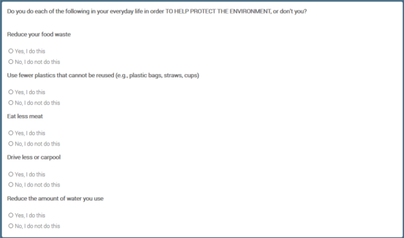

# Results

- Please note that here we simply refer to those who support the Republican party by simply "Republicans" and the Democratic Party by "Democrats."

- We tried the chi-squared independence test for every result given here. Due to the large sample (N~3600), unless otherwise stated, a visible relationship in a mosaic plot almost surely meant a rejection of the null hypotheses of independence at least in this analysis with p-values less than around 5%. On the other hand, not clear relationship in a mosaic plot sometimes also led to a rejection in this analysis with the same p-value range. 

## Question 1

We first explore the answer to the following question:

Q1. Although the survey pointed out supported parties as a relevant factor, are educations or incomes also related to the opinion toward climate change issues (ex. whether the climate change is due to human activities or just natural patterns in global climate)? We address this issue upon trying to control other relevant effects such as supported parties.

To see this, noting that the existing report suggests the strong relationship between a party one supports and his/her opinion. Hence, we should control parties, when we conduct an analysis for this question. 

Hence, we drew some mosaic plots of opinion to climate change issues with faceting supported parties (Democratic and Republican) for several candidate of attributes.
Among them, we recognized a relationship between age categories and the opposition to nuclear power uses.

Here, we restricted to one of the most main topics of this survey, that is, whether human activities contribute to the climate change.
As a result, we recognized some attributes relating to the opinion.

The first one is age:

```{r fig.width=10}
ggplot(data = findf55_Q1_to_NA) +
  geom_mosaic(aes(x = product(human, AGECA), fill = human))+
  scale_fill_manual(name="Human activities contributes to \n global climate change...",values = c("lightpink4","lightpink3","lightpink1","gray90"))+
  ggtitle("Republicans with higher age suspect \n less human contribution to climate change \n Age seems to mean nothing for Democrats")+
  facet_grid(.~PARTY)+theme_bw(16)+theme(axis.title.y=element_blank())+xlab("Age categories")
```


As seen from the plot above, while age is not likely to have a clear relationship for Democrats, younger Republicans are more likely to think humans are responsible for the climate change . It is of interest that what the reason is. There are several candidate factors to explain this. There are many hypotheses that tried demystifying the reason such as overlap with the serge of international discussion on climate change and their puberty, or they have high interest because they have to live longer from now. For more detail, see this (Columbia Climate School):

https://news.climate.columbia.edu/2019/02/04/age-gap-environmental-politics/

Actually, this result is quite consistent with the results written in the URL above.

Another finding is that most of people (almost 80-90%) think human activities more or less contribute to the global climate change.
The difference is on the degree of impacts.

The next relevant attribute that we have found is income:

```{r fig.width=10}
ggplot(data = findf55_Q1_to_NA) +
  geom_mosaic(aes(x = product(human, INCOM), fill = human))+
  scale_fill_manual(name="Human activities contributes to \n global climate change...", values = c("lightpink4","lightpink3","lightpink1","gray90"))+
  facet_grid(.~PARTY)+coord_flip()+
  ggtitle("Income has assynmetric relationship for each party")+
  theme_bw(16)+theme(axis.title.x=element_blank(),
        axis.text.x=element_blank(),
        axis.ticks.x=element_blank())+ xlab("Income categories")
```


Here, we see the contrasting results for the both parties, which is really interesting.
Democrats with higher or middle income are more likely to think human activities contribute to more, while Republicans with higher or middle income are less likely to do.
Since income and education levels are correlated, it would not be surprising if we had such an opposite tendencies on the education level, too. However, since the tendency is not so clear for Republicans on education (see the chi-squared independence tests below), we suspect that there may be some unique reason for the relationship with income, and it is not just that education is a confounding factor. Therefore, it is worth investigating more.

```{r fig.width=10}
ggplot(data = findf55_Q1_to_NA) +
  geom_mosaic(aes(x = product(human, EDUCC), fill = human))+
  scale_fill_manual(name="Human activities contributes to \n global climate change...", values = c("lightpink4","lightpink3","lightpink1","gray90"))+
  facet_grid(.~PARTY)+coord_flip()+
  ggtitle("Regardless of correlation between education and income, \n effect of education for Republicans is not clear")+
  theme_bw(16)+theme(axis.title.x=element_blank(),
        axis.text.x=element_blank(),
        axis.ticks.x=element_blank())+ xlab("Education levels")
```


```{r}
## define the chi-squared independence test for a cross table as a dataframe:

chisq.test.df <- function(crosstable){

A <- matrix(0,nrow(crosstable),ncol(crosstable)-1)

for(i in 1:nrow(crosstable)){
  for(j in 1:(ncol(crosstable)-1)){
    a <- as.numeric(crosstable[i,j+1])
    if(is.na(a)){A[i,j] <- 0} else {A[i,j] <- a}
  }
}

return (chisq.test(A))
}
```


- chi-squared independence test for income levels and the degree human activities contribute to for only Republicans: we reject the null hypothesis that both are independent.

```{r}
findf55_Q1_to_NA %>% filter(PARTY=="Repub") %>%
  group_by(INCOM,human) %>%
  summarize(n()) %>% pivot_wider(names_from=human,values_from = 'n()') %>% chisq.test.df()
```


- chi-squared independence test for education levels and the degree human activities contribute to for only Republicans: we cannot reject the null hypothesis that both are independent.

```{r}
findf55_Q1_to_NA %>% filter(PARTY=="Repub") %>%
  group_by(EDUCC,human) %>%
  summarize(n()) %>% pivot_wider(names_from=human,values_from = 'n()') %>% chisq.test.df()
```


The last relevant factor is sex:

```{r fig.height=5, fig.width=8}
ggplot(data = findf55_Q1_to_NA) +
  geom_mosaic(aes(x = product(human, SEX), fill = human))+
  scale_fill_manual(name="Human activities contributes to \n global climate change...", values = c("lightpink4","lightpink3","lightpink1","gray90"))+
  facet_grid(.~PARTY)+theme_bw(16)+
  ggtitle("Sex has also assymnetric relationship for each party")+theme(axis.title.y=element_blank())+xlab("Sex")
```

Although the difference itself is relatively small, it is quite interesting that male are a little more likely to think that human activities contribute to the climate change, but opposite for Republicans. Actually, it is consistent with the proportion of opposition to coal mining (see Question 3), which may mean that male Democrats are little more likely to affirmative to the environmental protection.

```{r}
findf55_Q1_to_NA %>% filter(PARTY=="Demo") %>%
  group_by(SEX,human) %>%
  summarize(n()) %>% pivot_wider(names_from=human,values_from = 'n()') %>% chisq.test.df()
```

Lastly, we did not detect any relevant relationship with (1) regions, (2) whether one lives in metropolitan area or not, or (3) marital status, thereby omitted the results.

## Question 2

Q2. From the survey, it is seen that Democrats are more likely to say that the federal government is doing too little for key aspects of the environment, and Democrats are more likely to think the climate change is due to human activities. With respect to this, are Democrats (Republicans) also more (less) recognizing that the climate change is affecting their local communities (no matter what the reason of the change is) in the first place? We address this issue upon trying to control other relevant effects such as regions.

The existing report above suggests people living in the Pacific region are more likely to experience some climate change. Here, it is known that there are more Democrats in the Pacific region. Hence, we should control regions, when we conduct an analysis for this question. Specifically, for every region we calculated the proportions of those who are recognizing that the climate change is affecting their community among each party, comparing the proportions of the two parties in each region.

Hence, we drew again some mosaic plots representing the proportions of recognizing that the climate change is affecting their local communities.

There are two types of flows of questions in the user interface of the survey. Thus, there are two types of variables that represent the proportions.
However, since both ended up with similar results, we present only one as below:

```{r fig.height=5, fig.width=18}
findf55_Q2_comm <- findf55_Q2 %>% dplyr::select(comm, PARTY, CDIVI) %>% na.omit

ggplot(data = findf55_Q2_comm) +
  geom_mosaic(aes(x = product(comm, PARTY), fill = comm))+
  scale_fill_manual(name="Global climate change is \n affecting your community...", values = c("lightpink4","lightpink3","lightpink1","gray90"))+
  ggtitle("Republicans less likely to observe climate change affecting their communities in the first place")+
  facet_grid(.~CDIVI)+theme_bw(14)+theme(axis.title.y=element_blank())+xlab("Parties")
```


One can see in every region, there are large difference between the two parties of the proportion of the extent to which the climate change is affecting their communities.

It implies that not only Republicans are likely to attribute climate change to natural phenomenon but also they are less likely to observe climate change affecting their communities in the first place.
Hence, there are composite reasons yielding the difference of attitude towards climate change between those parties.

We think that the question whether climate change is affecting our communities is easier to handle than the one whether climate change is heavily due to human activities or not if any.
Therefore, this result tells us that we should first review research regarding the existence of impact of climate change on our communities, and if any, that would be the start point to discuss the impact of human activities on climate change. This is where Data Science comes in since it essentially requires statistical points of view.

In this regard, lastly we want to point out that there are both types of climate change that have relatively small or large differences in proportions between the two parties.
Specifically, (1) more frequent wildfires, (2) rising sea levels, and (3) water shortages have relatively smaller differences, while (4) harm to animal wildlife and their habitats and (5) damage to forests and plant life have larger ones (probably since they are not so familiar affairs to our daily lives) as seen from the two illustrative plots below. Thus, reviewing research regarding the latter ones are considered to be of high priorities.

```{r fig.height=5, fig.width=18}
findf55_Q2_water <- findf55_Q2 %>% dplyr::select(water, PARTY, CDIVI) %>% na.omit

ggplot(data = findf55_Q2_water) +
  geom_mosaic(aes(x = product(water, PARTY), fill = water))+
  scale_fill_manual(name="Droughts and \n water shortages \n affecting your community?", values = c("lightpink3","gray80"))+
  facet_grid(.~CDIVI)+theme_bw(14)+
  ggtitle("Water shortage has smaller difference between parties: \n familiar affairs to our daily lives?")+
  theme(axis.title.y=element_blank())+xlab("Parties")


findf55_Q2_animal <- findf55_Q2 %>% dplyr::select(animal, PARTY, CDIVI) %>% na.omit

ggplot(data = findf55_Q2_animal) +
  geom_mosaic(aes(x = product(animal, PARTY), fill = animal))+
  scale_fill_manual(name="Harm to animal wildlife \n and their habitats \n affecting your community?", values = c("lightpink3","gray80"))+
  facet_grid(.~CDIVI)+theme_bw(14)+
  ggtitle("Harm to animal wildlife has larger difference between parties: \n not so familiar affairs to our daily lives?")+
  theme(axis.title.y=element_blank())+xlab("Parties")
```


## Question 3

Q3. From the survey, it is seen that majority of people think that they should decrease the oil drilling or coal mining, and they should increase natural electricity generations such as one by wind or land heat. However, their opinion is separate with respect to whether they should increase the new clear power plants (Yes:49% vs No:49%). Here, how do factors (sex, age, party, income, regions,…) relate to the choice Yes and No.

To see this, we can calculate and compare the proportions of Yes and No for each candidate factor such as sex, age, party, income and regions. We can also conduct the chi-squared t tests to add independent analyses.

Actually, we saw that supporting parties are highly related to the opposition rates. Higher for Democrats, and lower for Republicans.
Hence, similarly to Q1, we drew some mosaic plots with faceting supported parties (Democratic and Republican) for several candidate of attributes.

Among them, we recognized a relationship between some attributes and the opposition to nuclear power uses.

The first one is age categories similarly to Question 1.

```{r fig.width=10}
ggplot(data = findf55_Q3_to_NA) +
  geom_mosaic(aes(x = product(nuclear, AGECA), fill = nuclear))+
  scale_fill_manual(name="Nuclear power use", values = c("lightpink3","gray80"))+
  facet_grid(.~PARTY)+theme_bw(16)+
  ggtitle("Age vs nuclear power use for each party \n assynmetric relationship")+
  theme(axis.title.y=element_blank())+xlab("Age Categories")
```


As seen from the graph, Democrats have higher average level of opposition rate to nuclear uses than Republicans.
It is interesting that while people who support Democrats have similar opposition rates over all age categories, for those who support Republican, younger ones have higher opposition rates. In fact, the same tendencies are observed from any other energy resources no matter they have lower opposition rate (solar power use) or higher one (coal mining) in average.

This may mean that younger people are not only humans are responsible for the climate change (Question 1), but also are more likely to have interest in protection of environment. Republican party should pay attention to whether younger Republican will become more favor to nuclear uses, or their opinion will not change in the future.

The next relevant attribute is income (or education) levels.

```{r fig.width=13}
ggplot(data = findf55_Q3_to_NA) +
  geom_mosaic(aes(x = product(nuclear, INCOM), fill = nuclear))+
  scale_fill_manual(name="Nuclear power use", values = c("lightpink3","gray80"))+
  facet_grid(.~PARTY)+coord_flip()+theme_bw(16)+
  ggtitle("Income level vs nuclear power use for each party: \n another assynmetric relationship")+
  theme(axis.title.x=element_blank())+xlab("Income levels")
```

As seen from above, while income levels are not clearly related to opposition rates for Democrats, there seems to be a decreasing relationship for Republicans. As income and education levels are correlated, we see the similar relationship for education level, too. However, we are not sure whether the education level is a confounding factor or not, since it is difficult to come up with the reason why higher education drives only Republicans (not Democrats) to be in favor of nuclear power use more. Perhaps, their 
professions have something to do with their views on environmental issue, which cannot be answered since there are no information for their professions in the survey. Here is one of the limitation of our EDVA, but it can be a motivation for other research or policies.

The last relevant attribute is sex. As seen from the plot below, there are relatively large difference between sex.

```{r }
ggplot(data = findf55_Q3_to_NA) +
  geom_mosaic(aes(x = product(nuclear, SEX), fill = nuclear))+
  scale_fill_manual(name="Nuclear power use", values = c("lightpink3","gray80"))+
  facet_grid(.~PARTY)+theme_bw(16)+
  ggtitle("Sex vs nuclear power use for each party: \n male Democrats want to use nuclear power \n to protect environment?")+
  theme(axis.title.y=element_blank())+xlab("Sex")
```


Note that since some people think that nuclear power is useful to decrease the coal or oil mining and therefore effective to protect natural environment. 
The result above may signify that men are more like to think that way than women.

Indeed, comparing this result with the one for coal mining, male Democrats seem to be willing to protect the environment no less than female Democrats,
which is probably consistent with the result of the recognition of impacts of human activities in Question 1 as we mentioned earlier.
Though we do not show here, we observed very similar result for oil-gas mining, too.

```{r }
ggplot(data = findf55_Q3_to_NA) +
  geom_mosaic(aes(x = product(coal, SEX), fill = coal))+
  scale_fill_manual(name="Nuclear power use", values = c("lightpink3","gray80"))+
  facet_grid(.~PARTY)+theme_bw(16)+
  ggtitle("Sex vs coal mining for each party: \n male Democrats want to protect environment?")+
  theme(axis.title.y=element_blank())+xlab("Sex")
```

Lastly, we did not detect any relevant relationship with (1) regions, (2) whether one lives in metropolitan area or not, or (3) marital status, thereby omitted the results.


## Question 4

Besides people's perception of climate and environment problems, it's important to know how willing are they to take actions to tackle those problems. (After all, actions speak louder than words.)

In an survey conducted by the Pew center in 2019, people were asked if they would do things in their daily life to protect the environment. Specifically, the questions are:
        
    
To simplify the analysis, we aggregated the answers to those 5 questions and excluded all answers of refusal. We generate a new variable `EnvActCount` that equals the number of yes answers to the five questions.

First, let's see the overall distribution.
    

```{r}
W55=W55 %>%
        filter(EN6F1count_W55 != "DK/Refused to any a - e") %>%
        mutate(EnvActCount=replace(EN6F1count_W55,
                                      EN6F1count_W55=="I do none of these", "0 of these")) %>%
        mutate(EnvActCount=as.numeric(as.character(fct_recode(as.factor(EnvActCount),
                                        "0"="0 of these", "1"="1 of these",
                                        "2"="2 of these", "3"="3 of these",
                                        "4"="4 of these", "5"="I do all 5 of these",
                                        ))))
```

```{r}
W55 %>%
        filter((!is.na(CLIM9F1_b_W55))
               & CLIM9F1_b_W55 != "Refused") %>%
        mutate(CLIM9F1_b_W55 = fct_relevel(as.factor(CLIM9F1_b_W55),
                                         c('A great deal','Not too much','Some','Not at all'))) %>%
        ggplot(aes(x=EnvActCount))+
            geom_bar(aes( y=..count../sum(..count..))) +
            xlab("EnvActCount") + ylab("Percentage") +
            scale_x_continuous(breaks=c(0,1,2,3,4,5)) + scale_y_continuous(labels = scales::percent)

```

We can see that Americans are generally willing to take some action to protect the environment: more than half are willing to do at least three of the five in their daily life.

What's more interesting is the factors affecting this. Naturally, we assume if someone fells his community is suffering from environmental problems, he would be more willing to take actions to combat them. This is confirmed by the data.

(Note: in the questionnaire, the question asked was "How much, if at all, do you think global climate change is currently affecting your local community", which isn't exactly about the environment, but it's reasonable to use that as a proxy.)

```{r}
W55 %>%
        filter((!is.na(CLIM9F1_b_W55))
               & CLIM9F1_b_W55 != "Refused") %>%
        mutate(CLIM9F1_b_W55 = fct_relevel(as.factor(CLIM9F1_b_W55),
                                         c('Not at all','Not too much','Some', 'A great deal'))) %>%
        mutate(EnvActCount=factor(EnvActCount)) %>%
        ggplot() +
                geom_mosaic(aes(weight=1, x=product(EnvActCount, CLIM9F1_b_W55), fill=EnvActCount)) +
                theme(legend.position="none") +
                xlab("How much do you think global climate change is currently affecting your local community")
                
```

Indeed, if people think their community is more affected, they are more willing to take actions themselves to counter the effect.

Though the wordings `Not too much` and `Some` sound similar, the order in the plot represents the order those options are presented in the questionnaire, so respondents would naturally perceive them are ordered as `Not at all`, `Not so much`, `Some`, `A great deal`.

An even more interesting question is whether certain personality traits affect people's willingness to take those actions. In the questionnaire, people were asked to rate themselves on the following scales from 1 to 5:
- `Extroverted` to `Introverted`
- `Hard-working` to `Lazy`
- `Conventional thinker` to `Creative thinker`
- `Calm` to `Nervous`
- `Outgoing` to `Shy`
- `Impulsive` to `Self-disciplined`
- `Sympathetic` to `Unsympathetic`
- `Disorganized` to `Organized`
- `Analytical` to `Not analytical`
- `Relaxed` to `Tense`
- `Accepting of others` to `Critical of others`
- `Intellectual` to `Not intellectual`

Self ratings on each of the scales has significant correlation with `EnvActCount`. This is not surprising since the sample size is large. Here we are presenting the most interesting results.

We decided to control for people's perception of the effect of climate change, because it is affected by people's personalities, and we want to capture the direct effect of personality.

```{r}
plot_pers_env =function(a){
    df = W55 %>%
        filter(W55[[a]] != "99" & EN6F1count_W55 != "DK/Refused to any a - e"
               & CLIM9F1_b_W55 %in% c("A great deal", "Not at all")) %>%
        mutate(Pers=.data[[a]]) 
        
    p = ggplot(df) +
            stat_summary(aes(x=Pers, y=EnvActCount, color=CLIM9F1_b_W55), fun="mean") +
            ylab("Average of EnvActCount") + xlab("Self reported personality trait") +
            scale_color_discrete(name="How do you think\nglobal climate change is\naffecting your community")
#     geom_flow() +
#                     geom_stratum() + 
#                     geom_text(stat = "stratum", infer.label = TRUE)
    
    return(p)
}
```

```{r}
plot_pers_env("PERS8_W55")
```

Disorganized people tend to be more willing to act on climate change, even if they don't feel their community is affected much. This is worth investigating since the difference is significant, while there's no clear explanation for this.

```{r}
plot_pers_env("PERS12_W55")
```

Intellectual people's willingness to act to protect the environment is more determined by their perception of how serious the problem is.

A side note: though some of traits sound disapproving (e.g. disorganized), the number of people that identify themselves as of these traits aren't small, so this won't affect the validity of the analysis.


A further step would be doing clustering or PCA on the personality traits, and observe the differences. However, since we have little knowledge in psychology, we won't be able to interpret the results, so we chose not to include these.


## Question 5

People's views on climate change and environmental problems differ by the party the support. For example, supporters of the GOP tend to think that policies aimed at reducing the effect of climate change will hurt the economy, while the Democrats tend to think they have benefits.

```{r}
W33 %>%
    filter(CLIM5_W33!="Refused" & F_PARTY_FINAL!="Refused") %>%
    mutate(CLIM5_W33 = factor(CLIM5_W33, levels=c('Help the U.S. economy',
                                                  'Make no difference for the U.S. economy',
                                                  'Hurt the U.S. economy'))) %>%
    mutate(CLIM5_W33=recode_factor(CLIM5_W33, `Help the U.S. economy`="Positive",
                                   `Make no difference for the U.S. economy`="Neutral",
                                    `Hurt the U.S. economy`="Negative")) %>%
    mutate(F_PARTY_FINAL=recode_factor(F_PARTY_FINAL, `Something else`="Else")) %>%
    ggplot(aes(y=1, axis1=CLIM5_W33, axis2=F_PARTY_FINAL, fill=F_PARTY_FINAL)) +
        geom_flow() +
        geom_stratum() + 
        geom_text(stat = "stratum", infer.label = TRUE) +
        scale_fill_manual(values=c("Democrat"="royalblue2", "Republican"="Red",
                                  "Independent"="yellow", "Something else"="grey")) +
        scale_x_discrete(limits=c("Perception of climate adaptation\n policies' effect on economy",
                                  "Political stance")) + ylab("") +
        coord_flip() + theme(legend.position="none")
```

Similar trends appear in other climate and environment related issues.

These association are on the individual level. If we aggregate them, we might be able to see a correlation with elections outcomes.

We have Pew's survey data about environment and climate change in 2018 and 2020, which are both election years (and the surveys are prior to elections). We used the House election data instead of Senate because all House seats but only one third of Senate seats are open for election every two years, which means there's extra sources of variation for Senate elections. We didn't use Presidential election because we don't have survey data in 2016.

Unfortunately, the survey data only allows for aggregation by census region (South, West, Northeast, and Midwest, each consisting of around 10 states). This means we will only have 4 data points for a year, which precludes regression and statistical tests. Nevertheless, the difference across the regions and the trends are very obvious.

```{r}
W67_env_dummies = dummy.data.frame(W67 %>% select(c(F_CREGION, ENVIR8_a_W67,ENVIR8_b_W67,ENVIR8_c_W67,
                                  ENVIR8_d_W67, ENVIR8_e_W67)) %>% as.data.frame(),
                 names=c('ENVIR8_a_W67','ENVIR8_b_W67','ENVIR8_c_W67','ENVIR8_d_W67','ENVIR8_e_W67'),
                 sep=":") %>%
    tibble() 

W67_ENVIR8_TOO_LITTLE =
W67_env_dummies  %>%
    group_by(F_CREGION) %>%
    summarise_all(mean) %>%
    inner_join(W67_env_dummies  %>%
                    group_by(F_CREGION) %>%
                    summarise(N=n()),
              by="F_CREGION") %>%
    select(ends_with("Too little") | starts_with("F_") | starts_with("N"))

colnames(W67_ENVIR8_TOO_LITTLE) <- colnames(W67_ENVIR8_TOO_LITTLE) %>%
                                    str_replace("ENVIR8_(.)_W67:Too little", "\\1") %>%
                                    str_to_lower()
```

```{r}
W33_env_dummies = dummy.data.frame(W33 %>% select(c(F_CREGION_FINAL, ENVIR8A_W33, ENVIR8B_W33,
                                                    ENVIR8C_W33, ENVIR8D_W33, ENVIR8E_W33)) %>% as.data.frame(),
                 names=c('ENVIR8A_W33','ENVIR8B_W33','ENVIR8C_W33','ENVIR8D_W33','ENVIR8E_W33'),
                 sep=":") %>%
    tibble() 

W33_ENVIR8_TOO_LITTLE =
W33_env_dummies  %>%
    group_by(F_CREGION_FINAL) %>%
    summarise_all(mean) %>%
    inner_join(W33_env_dummies  %>%
                    group_by(F_CREGION_FINAL) %>%
                    summarise(N=n()),
              by="F_CREGION_FINAL") %>%
    select(ends_with("Too little") | starts_with("F_") | starts_with("N")) %>%
    rename(F_CREGION = F_CREGION_FINAL)

colnames(W33_ENVIR8_TOO_LITTLE) <- colnames(W33_ENVIR8_TOO_LITTLE) %>%
                                    str_replace("ENVIR8(.)_W33:Too little", "\\1") %>%
                                    str_to_lower()
```

```{r}
envir8_2018_2020 =
bind_rows(
    W33_ENVIR8_TOO_LITTLE %>% 
        mutate(year=2018) %>%
        pivot_longer(cols = !f_cregion & !year, names_to = "Question", values_to = "too little"),
    W67_ENVIR8_TOO_LITTLE %>% 
        mutate(year=2020) %>%
        pivot_longer(cols = !f_cregion & !year, names_to = "Question", values_to = "too little")
) %>% filter(Question!="n") %>% mutate(year=as.factor(year))

```

```{r}
#A nuisance here is that in Minnesota the Democratic party goes by Democratic-Farmer-Labor,
# and in North Dakota Democratic_NPL. We need to manually handle those two.

# Also, in DC, there's no Republican candidate for Representatives,
#so we need to specify values_fill=0 to avoid producing an NA which will ruin the sum function used later.

House_elec = read.csv("./data/Election_data/1976-2020-house.csv")
House_2018_2020 = House_elec %>%
    tibble() %>%
    filter(year %in% c(2018,2020)) %>%
    mutate(party = plyr::mapvalues(party,
                             c("DEMOCRATIC-FARMER-LABOR", "DEMOCRATIC-NPL", "DEMOCRATIC-NONPARTISAN LEAGUE",
                               "DEMOCRAT", "REPUBLICAN"),
                             c("Dem", "Dem", "Dem", "Dem", "Rep"))) %>%
    filter(party %in% c("Dem", "Rep")) %>%
    group_by(year, party, state_po) %>%
    summarise(votes=sum(as.numeric(candidatevotes))) %>%
    ungroup() %>%
    pivot_wider(names_from = "party", values_from = "votes", values_fill = 0) 
```

```{r}
ELEC_2018 = House_2018_2020 %>% filter(year==2018)
```

```{r eval = FALSE}
ELEC_2018_REGION = inner_join(ELEC_2018, st_drop_geometry(states()), by=c("state_po"="STUSPS")) %>%
    group_by(REGION) %>%
    summarise(DEM=sum(Dem), REP=sum(Rep)) %>%
    mutate(pct_dem=DEM/(DEM+REP))
```

The four census regions are shown below.

```{r eval = FALSE}
regions() %>% 
    ggplot(aes(geometry=geometry, fill=NAME)) +
        geom_sf() + 
        scale_fill_discrete(name="Census region") +
        xlim(c(-125,-65)) +
        ylim(c(20,50))
```

In both 2018 and 2020, we can see that if people think the government isn't doing enough on climate and environment issues, they tend to support the Democratic party. Exceptions are animal and water protection. It seems the two are not so important.

Note that the support for Democrats are calculated as the ratio of people who voted for a Democratic candidate in the census region. It's not the average of average in each state.

```{r eval = FALSE}
ELEC_2020 = House_2018_2020 %>% filter(year==2020)
ELEC_2020_REGION = inner_join(ELEC_2020, st_drop_geometry(states()), by=c("state_po"="STUSPS")) %>%
    group_by(REGION) %>%
    summarise(DEM=sum(Dem), REP=sum(Rep)) %>%
    mutate(pct_dem=DEM/(DEM+REP))
```

```{r eval = FALSE}
ENVIR8_question = list("a"="Protect air quality",
                       "b"="Protect water quality",
                       "c"="Protect animals",
                       "d"="Protect land",
                       "e"="Deal with climate change"
                      )

```

```{r eval = FALSE}
inner_join(ELEC_2018_REGION,
        inner_join(W33_ENVIR8_TOO_LITTLE, st_drop_geometry(regions()),
           by=c("f_cregion"="NAME")),
        by=c("REGION"="REGIONCE")) %>% 
    pivot_longer(cols = c(a,b,c,d,e), names_to = "Question", values_to = "too little") %>%
    mutate(Question=sapply(Question,
                           function(i){return(ENVIR8_question[[i]])})) %>%
    ggplot(aes(x=pct_dem, y=`too little`)) +
        geom_point(aes(shape=f_cregion)) +
        stat_smooth(method="lm", se=F) +
        facet_wrap(~Question) +
        scale_y_continuous(labels = scales::percent_format(scale=100, accuracy=1)) +
        scale_x_continuous(labels = scales::percent_format(scale=100, accuracy=1)) +
        xlab("") + ylab("") +scale_shape_discrete(name="Census region") +
        ggtitle("Support for Democrats in 2018 House elections (horiz.) vs \nPercentage who thinks the federal governmentis doing too little to...")
```

```{r eval = FALSE}
inner_join(ELEC_2020_REGION,
        inner_join(W67_ENVIR8_TOO_LITTLE, st_drop_geometry(regions()),
           by=c("f_cregion"="NAME")),
        by=c("REGION"="REGIONCE")) %>% 
    pivot_longer(cols = c(a,b,c,d,e), names_to = "Question", values_to = "too little") %>%
    mutate(Question=sapply(Question,
                           function(i){return(ENVIR8_question[[i]])})) %>%
    ggplot(aes(x=pct_dem, y=`too little`)) +
        geom_point(aes(shape=f_cregion)) +
        geom_smooth(method="lm", se=F) +
        facet_wrap(~Question) +
        scale_y_continuous(labels = scales::percent_format(scale=100, accuracy=1)) +
        scale_x_continuous(labels = scales::percent_format(scale=100, accuracy=1)) +
        scale_shape_discrete(name="Census region") +
        xlab("") + ylab("") + 
        ggtitle("Support for Democrats in 2020 House elections (horiz.) vs \nPercentage who thinks the federal governmentis doing too little to...")
```

However, when we take the difference in the two years. It's a different story. The trend has reversed. If more people fell the government is not doing enough on the issues, more people are voting for the GOP.

What's happening here? We should take note that from 2016 to 2018, the Republicans had majority in the House, while the Democrats took over the majority in 2018. Before elections, people are likely to blame the incumbent for not taking enough action.

```{r eval = FALSE}
cregion_code = c("Midwest"='2', "Northeast"='1',"South"='3',"West"='4')
diff_envir8 = inner_join(W33_ENVIR8_TOO_LITTLE, W67_ENVIR8_TOO_LITTLE,
                   by="f_cregion", suffix=c("2018", "2020")) %>%
            mutate(diff_a=a2018-a2020,
                diff_b=b2018-b2020,
                diff_c=c2018-c2020,
                diff_d=d2018-d2020,
                diff_e=e2018-e2020) %>%
            mutate(REGION=sapply(f_cregion, function(x){return(cregion_code[[x]])}))


diff_elec = inner_join(ELEC_2018_REGION, ELEC_2020_REGION, by="REGION", suffix=c("2018", "2020")) %>%
            mutate(diff_dem_pct=pct_dem2018-pct_dem2020)

inner_join(diff_envir8, diff_elec,
        by="REGION") %>%
    select(starts_with("diff") | f_cregion) %>%
    pivot_longer(!c(diff_dem_pct, f_cregion), names_to = "Question") %>%
    mutate(Question=sapply(Question,
                           function(i){return(ENVIR8_question[[str_sub(i,-1,-1)]])})) %>%
    ggplot(aes(x=diff_dem_pct, y=value)) +
        geom_point(aes(shape=f_cregion)) +
        geom_smooth(method = "lm", se=F) +
        facet_wrap(~Question) + scale_shape_discrete(name="Census region") + xlab("") + ylab("") + 
        scale_y_continuous(labels = scales::percent_format(scale=100)) +
        scale_x_continuous(labels = scales::percent_format(scale=100), n.breaks = 2) +
        ggtitle("Change in support for Democrats in House elections (horiz.) vs \nChange in percentage who thinks the federal governmentis doing too little to...")

```


