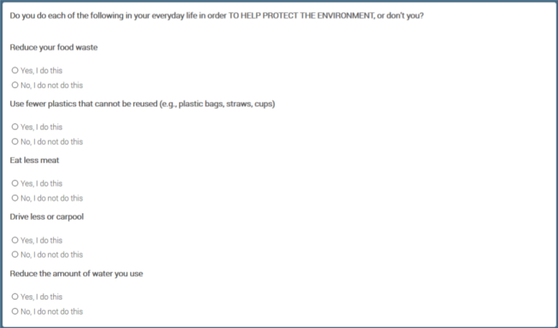

---
jupyter:
  jupytext:
    formats: ipynb,Rmd
    text_representation:
      extension: .Rmd
      format_name: rmarkdown
      format_version: '1.2'
      jupytext_version: 1.13.0
  kernelspec:
    display_name: R
    language: R
    name: ir
---

```{r}
library(tigris)
library(tidyverse)
library(ggalluvial)
library(openxlsx)
library(parcoords)
library(vcd)
library(ggmosaic)
library(corrr)
library(rcompanion)
```

```{r}
W55 = read.xlsx("../data/W55_Oct19/ATP W55 Weighted Resample.xlsx") %>% tibble()
```

# People's willingness to take action to protect the environment

Besides people's perception of climate and environment problems, it's important to know how willing are they to take actions to tackle those problems. (After all, actions speak louder than words.)

In an survey conducted by the Pew center in 2019, people were asked if they would do things in their daily life to protect the environment. Specifically, the questions are:
        
    
To simplify the analysis, we aggregated the answers to those 5 questions and excluded all answers of refusal. We generate a new variable `EnvActCount` that equals the number of yes answers to the five questions.

First, let's see the overall distribution.
    

```{r}
W55=W55 %>%
        filter(EN6F1count_W55 != "DK/Refused to any a - e") %>%
        mutate(EnvActCount=replace(EN6F1count_W55,
                                      EN6F1count_W55=="I do none of these", "0 of these")) %>%
        mutate(EnvActCount=as.numeric(as.character(fct_recode(as.factor(EnvActCount),
                                        "0"="0 of these", "1"="1 of these",
                                        "2"="2 of these", "3"="3 of these",
                                        "4"="4 of these", "5"="I do all 5 of these",
                                        ))))
```

```{r}
W55 %>%
        filter((!is.na(CLIM9F1_b_W55))
               & CLIM9F1_b_W55 != "Refused") %>%
        mutate(CLIM9F1_b_W55 = fct_relevel(as.factor(CLIM9F1_b_W55),
                                         c('A great deal','Not too much','Some','Not at all'))) %>%
        ggplot(aes(x=EnvActCount))+
            geom_bar(aes( y=..count../sum(..count..))) +
            xlab("EnvActCount") + ylab("Percentage") +
            scale_x_continuous(breaks=c(0,1,2,3,4,5)) + scale_y_continuous(labels = scales::percent)

```

We can see that Americans are generally willing to take some action to protect the environment: more than half are willing to do at least three of the five in their daily life.

What's more interesting is the factors affecting this. Naturally, we assume if someone fells his community is suffering from environmental problems, he would be more willing to take actions to combat them. This is confirmed by the data.

(Note: in the questionnaire, the question asked was "How much, if at all, do you think global climate change is currently affecting your local community", which isn't exactly about the environment, but it's reasonable to use that as a proxy.)

```{r}
W55 %>%
        filter((!is.na(CLIM9F1_b_W55))
               & CLIM9F1_b_W55 != "Refused") %>%
        mutate(CLIM9F1_b_W55 = fct_relevel(as.factor(CLIM9F1_b_W55),
                                         c('Not at all','Not too much','Some', 'A great deal'))) %>%
        mutate(EnvActCount=factor(EnvActCount)) %>%
        ggplot() +
                geom_mosaic(aes(weight=1, x=product(EnvActCount, CLIM9F1_b_W55), fill=EnvActCount)) +
                theme(legend.position="none") +
                xlab("How much do you think global climate change is currently affecting your local community")
                
```

Indeed, if people think their community is more affected, they are more willing to take actions themselves to counter the effect.

Though the wordings `Not too much` and `Some` sound similar, the order in the plot represents the order those options are presented in the questionnaire, so respondents would naturally perceive them are ordered as `Not at all`, `Not so much`, `Some`, `A great deal`.

An even more interesting question is whether certain personality traits affect people's willingness to take those actions. In the questionnaire, people were asked to rate themselves on the following scales from 1 to 5:
- `Extroverted` to `Introverted`
- `Hard-working` to `Lazy`
- `Conventional thinker` to `Creative thinker`
- `Calm` to `Nervous`
- `Outgoing` to `Shy`
- `Impulsive` to `Self-disciplined`
- `Sympathetic` to `Unsympathetic`
- `Disorganized` to `Organized`
- `Analytical` to `Not analytical`
- `Relaxed` to `Tense`
- `Accepting of others` to `Critical of others`
- `Intellectual` to `Not intellectual`

Self ratings on each of the scales has significant correlation with `EnvActCount`. This is not surprising since the sample size is large. Here we are presenting the most interesting results.

We decided to control for people's perception of the effect of climate change, because it is affected by people's personalities, and we want to capture the direct effect of personality.

```{r}
plot_pers_env =function(a){
    df = W55 %>%
        filter(W55[[a]] != "99" & EN6F1count_W55 != "DK/Refused to any a - e"
               & CLIM9F1_b_W55 %in% c("A great deal", "Not at all")) %>%
        mutate(Pers=.data[[a]]) 
        
    p = ggplot(df) +
            stat_summary(aes(x=Pers, y=EnvActCount, color=CLIM9F1_b_W55), fun="mean") +
            ylab("Average of EnvActCount") + xlab("Self reported personality trait") +
            scale_color_discrete(name="How do you think\nglobal climate change is\naffecting your community")
#     geom_flow() +
#                     geom_stratum() + 
#                     geom_text(stat = "stratum", infer.label = TRUE)
    
    return(p)
}
```

```{r}
plot_pers_env("PERS8_W55")
```

Disorganized people tend to be more willing to act on climate change, even if they don't feel their community is affected much. This is worth investigating since the difference is significant, while there's no clear explanation for this.

```{r}
plot_pers_env("PERS12_W55")
```

Intellectual people's willingness to act to protect the environment is more determined by their perception of how serious the problem is.

A side note: though some of traits sound disapproving (e.g. disorganized), the number of people that identify themselves as of these traits aren't small, so this won't affect the validity of the analysis.


A further step would be doing clustering or PCA on the personality traits, and observe the differences. However, since we have little knowledge in psychology, we won't be able to interpret the results, so we chose not to include these.
